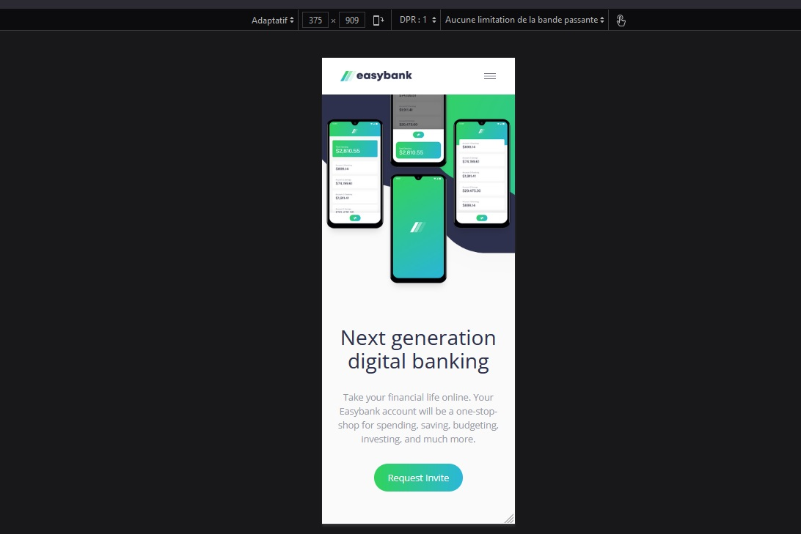

# Frontend Mentor - Easybank landing page solution

This is a solution to the [Easybank landing page challenge on Frontend Mentor](https://www.frontendmentor.io/challenges/easybank-landing-page-WaUhkoDN). Frontend Mentor challenges help you improve your coding skills by building realistic projects. 

## Table of contents

- [Overview](#overview)
  - [The challenge](#the-challenge)
  - [Screenshot](#screenshot)
  - [Links](#links)
- [My process](#my-process)
  - [Built with](#built-with)
  - [What I learned](#what-i-learned)
  - [Continued development](#continued-development)
  - [Useful resources](#useful-resources)
- [Author](#author)

**Note: Delete this note and update the table of contents based on what sections you keep.**

## Overview

### The challenge

Users should be able to:

- View the optimal layout for the site depending on their device's screen size
- See hover states for all interactive elements on the page

Self imposed rules

- Use React to build the landing page and only use functional components because I only built a few small apps with class components
- Use a CSS framework, here TailwindCSS, to style the landing page because I want to master a css framework
- Push this project with the terminal because I've started uploading my first bits of code on Github with the drag and drop feature but it takes time so I want to push only via CLI now

### Screenshot




### Links

- Live Site URL: [My solution](https://nabil-y.github.io/Easybank-React-Tailwind/)

## My process

### Built with

- Semantic HTML5 markup
- [React](https://reactjs.org/) - JS library
- [TailwindCSS](https://tailwindcss.com/) - Utility-first CSS framework
- Mobile-first workflow (included in TailwindCSS)

### What I learned

I learned so much about React and tailwind building this landing page, it was very challenging to solve all the challenges of this project.

Also it was combined with TailwindCSS so I had some other limitations. If you want to build a list, it can quickly become very verbose.

Tailwind recommends in their documentation to loop through an array to avoid massive blocks of repeated code so I stored all the content needed in arrays to create my HTML list in JSX.
The code looks cleaner and it respect the DRY principle. I appreciate this way and I don't think I'm copy/paste a list content manually ever again


```js
{data.featuresContent.map(item => <div key={item.key} className='flex flex-col lg:mr-8 last:lg:mr-0'>
                
                <h3 className='text-dark-blue text-xl py-4'>{item.title}</h3>
                <p className='text-grayish-blue'>{item.text}</p>
            </div>)}
```


Notice the classnames preceded by "lg:" ? lg: is a screen size breakpoint (1024px) and the property afterwards only apply if the window width is 1024px or higher. 
All styles whithout breakpoint are applied on all sizes so Tailwind is a mobile first framework thanks to that feature.

To produce cleaner code, I tried to follow a pattern when naming my classes
First background colors, followed by text properties (color and size), then margin/padding, then the rest
Afterwards I put media query classes from narrowest screens to biggest screens
And at last, I added hover effects.

I hope it is easier to read thanks to that


There was another challenge here, a small one but a complicated one (at least it was for me): add hover effect to SVG that will change their color.

I looked how to do it and it would be donne with the fill property. Tailwind has one but it didn't work.
After a lot of research I figured out that it was because the fill property don't work with  tags, only with <svg>.

Problem is, I was already looping through an array to add properties in an image tag and I didn't know if I could add whole SVG tags with the Array.map method.
Turns out you can store html tags in an array and map that array. I was very surprised but it shows the power of JSX.


### Continued development

I still feel I have only scratched the surface with React and there is still a lot to learn so I need to practice and study more on topics like hooks, lifecycle methods and state management solutions.
I also have to practice a lot with Tailwind, at first I was a little bit reluctant with the long class names but in the end, it is well structured and it helps save time. It is also customizable but it has some limitations like modifying root font site or removing highligh tap on mobile but I'm sure future updates will adress that.

### Useful resources

- [Tailwind Documentation](https://tailwindcss.com/docs/installation) - This was my first time using Tailwind so I had to read the documentation a lot. It is well structured so I had no problem looking for what I needed.
- [UseState video from Web Dev Simplified](https://www.youtube.com/watch?v=O6P86uwfdR0) - As I wanted to build this app with react functional component, I needed to learn hooks to manage state (for the dropdown menu on mobile). This video was very helpful to understand the basics of useState.

## Author

- Website - [Portfolio](https://nabil-y.github.io/ProjectHub/)
- Frontend Mentor - [@Nabil-Y](https://www.frontendmentor.io/profile/Nabil-Y)
